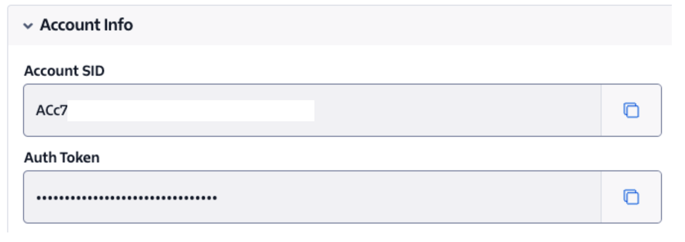

# **Twilio SMS Sender Service**

Twilio SMS Sender Service is a microservice application that allows you to send SMS verification messages to phone numbers and verify codes using the Twilio API.

This project is written in Go programming language and can be easily deployed using Docker.

---

## **Project Features**

- **Send SMS**: Sends SMS verification messages to phone numbers.
- **Verification Check**: Verifies the user-provided code through Twilio.
- **Error Management**: Handles and displays user-friendly error messages from Twilio API.
- **Modular Structure**: Clean code architecture divided into Business, Service, and Controller layers.
- **Easy Deployment**: Quickly deployable with Docker.

---

## **How to Install**

### **1. Obtain Twilio API Credentials**

You need a Twilio account to run this project. If you're using a trial account, you can only send messages to your own phone number. After creating your Twilio account, you can access the following details:

- **Account SID**: Available in the Twilio console (under Account Dashboard).
- **Auth Token**: The authentication token.


- **Service SID**: Service SID created for Twilio Verify Service (available under Verify > Services).
  
  
You can see these details after logging into your Twilio account.

---

### **2. Clone the Repository**

```bash
git clone https://github.com/username/twilio-sms-sender.git
cd twilio-sms-sender
```

---

### **3. Set Up Environment Variables**

Create a `.env` file in the project root directory and fill it with the following information:

```plaintext
TWILIO_ACCOUNT_SID=your_account_sid
TWILIO_AUTH_TOKEN=your_auth_token
TWILIO_SERVICE_SID=your_service_sid
```

---

### **4. Run with Docker**

You can quickly deploy the project using Docker:

1. **Build the Docker Image:**

   ```bash
   docker build -t sms-sender-service .
   ```

2. **Run the Container:**

   ```bash
   docker run --name sms-sender-service --env-file .env -p 8000:8000 sms-sender-service
   ```

---

## **API Usage**

### **1. Send SMS**

- **Endpoint**: `POST /api/twilio/send-verification`
- **Request**:
  ```bash
  curl -X POST http://localhost:8000/api/twilio/send-verification \
  -d "To=+90533333333" \
  -d "Channel=sms"
  ```
- **Response (Success)**:

  ```json
  {
    "status": "pending",
    "to": "+90533333333",
    "channel": "sms",
    "service_sid": "mock_service_sid",
    "created_at": "2024-11-15T13:13:15Z"
  }
  ```

- **Response (Error)**:
  ```json
  {
    "code": 60200,
    "message": "Invalid parameter `To`: +90533333810",
    "more_info": "https://www.twilio.com/docs/errors/60200",
    "status": 400
  }
  ```

---

### **2. Verify Code**

- **Endpoint**: `POST /api/twilio/check-verification`
- **Request**:
  ```bash
  curl -X POST http://localhost:8000/api/twilio/check-verification \
  -d "To=+90533333333" \
  -d "Code=123456"
  ```
- **Response (Success)**:

  ```json
  {
    "status": "approved",
    "to": "+90533333333",
    "valid": true,
    "channel": "sms",
    "service_sid": "mock_service_sid",
    "created_at": "2024-11-15T13:13:15Z",
    "updated_at": "2024-11-15T13:13:41Z"
  }
  ```

- **Response (Error)**:
  ```json
  {
    "code": 60200,
    "message": "Invalid verification code",
    "status": 400
  }
  ```

---

## **Project Structure**

```plaintext
twilio-sms-sender/
├── Dockerfile           # Configuration for Docker image
├── .env                 # Environment variables
├── main.go              # Application entry point
├── controllers/         # API Controller layer
├── business/            # Business logic layer
├── services/            # Twilio integration services
├── utils/               # Utility functions
├── mock/                # Mock services for testing
├── router/              # Router configurations
└── README.md            # Project documentation
```

---

## **Contributing**

If you'd like to contribute to this project, please feel free to submit a **pull request** or create an **issue**.

---

## **License**

This project is licensed under the [MIT License](LICENSE).
